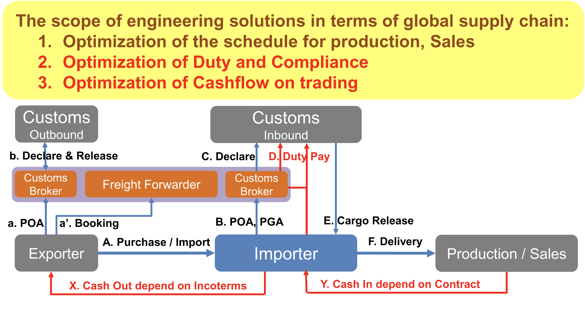

 
# Abstract
 
We propose the financing of international customs shipments by leveraging EDI data messaging through AS2 and combined with a centralized clearing party (freightttrust and clearing) to provide reduced friction in enabling container shipments, tariffs, duties and other import/export excise taxes to be financed through the MakerDAO platform.

 
## Overview of implementation stack
 
### Key Concepts
 
Two 'standards' that you may not be familiar with that are important in understanding are:
 
- AS2
- EDI Format
 
### EDI: Electronic Data Interchange
 
Electronic Data Interchange (EDI) in either the American National Standards Committee (ANSI) X12 format or the UN Electronic Data Interchange for Administration, Commerce, and Transport (UN/EDIFACT) format; or other structured data formats.  The data is packaged using standard MIME structures.
 
#### EDI Example
 
Below is a sample from a Lumbar company located in Canada that we have worked with:
```
ISA*00*          *00*          *ZZ*WFML           *ZZ*ADR            *161115*1432*U*00401*100001996*0*P*}
GS*BS*WFML*ADR*20161115*1432*2996*X*004010
ST*857*2996
BHT*0002*00*1881173*20161115
HL*1**S
G05*1*C4*187504*LB*107800*BF*56*PK
TD3*RR*NOKL*733832
TD5**2*BR*R*CN BUFF FOR BPRR DELY TO LACKAWANNA
FOB*PP***01*DDP
DTM*011*20161115
DTM*056*20161117
N9*SI*1881173
N9*CO*85017382
N9*WM*2023
N9*12*94550001
CUR*BT*USD
N1*SH*West Fraser Mills Ltd.*12*(250) 991-5499
N3*1250 Brownmiller Road
N4*Quesnel*BC*V2J6P5*CA
N1*SF*SUNDRE FOREST PRODUCTS*CM*105074124SL0001
N3*5310 27TH ST SE
N4*CALGARY,*AB*T2C1M7*CA
N1*CN*TIS*FI*16-1414803
N3*1155 NORTH SERVICE RD, UNIT 2
N4*OAKVILLE*ON*L6M3E3*CA
N1*CB*AD RUTHERFORD INTERNATIONAL INC.
HL*2*1*O
TDS*4271036
PRF*85017382
N9*OR*1122417
ITD*01*1*1**10
SAC*N*B030*MC*Z
SAC*C*D200***720321*******05
SAC*C*C310***42710*******05
SAC*C*B860***2450*******05
SAC*C*I130***3773*******05
SAC*C*C675***3505555
SAC*C*B994***3505600
N1*ST*SOUTH BUFFALO DIST CENTER*FI*91-047086000
N3*1951 HAMBURG TURNPIKE
N4*LACKAWANNA*NY*14218*US
HL*3*2*I
IT1*1*54.88*TM*380*UM*CH*CAN*ZZ*20854.4*XQ*440590
PO4*****N*94394*LB*129.502*CR
TC2*A*4407.10.0115
TC2*Z*4407.10.00.13
PID*F****Dimension Lumber
PID*F****SPF KD HT HILINE #2 & BTR S4S ALS EE DET 2 X 4 NLGA G/S
PID*F****28/10/8232
SLN*11*PGA*O*129.502*M3*20854***GE*SPF LUMBER*CH*CA*C3*PICEA&GLAUCA*F7*O4 RESALE
SLN*12*COMP*O**********C3*PICEA&ENGELMANNII
SLN*13*COMP*O**********C3*PINUS&CONTORTA
SLN*14*COMP*O**********C3*ABIES&LASIOCARPA
HL*4*2*I
IT1*2*52.92*TM*413*UM*CH*CAN*ZZ*21855.96*XQ*440590
PO4*****N*92610*LB*124.877*CR
TC2*A*4407.10.0115
TC2*Z*4407.10.00.13
PID*F****Dimension Lumber
PID*F****SPF KD HT HILINE #2 & BTR S4S ALS EE DET 2 X 6 NLGA G/S
PID*F****28/10/5292
SLN*11*PGA*O*124.877*M3*21856***GE*SPF LUMBER*CH*CA*C3*PICEA&GLAUCA*F7*O4 RESALE
SLN*12*COMP*O**********C3*PICEA&ENGELMANNII
SLN*13*COMP*O**********C3*PINUS&CONTORTA
SLN*14*COMP*O**********C3*ABIES&LASIOCARPA
SE*64*2996
GE*1*2996
IEA*1*100001996
```
 
 
### AS2: P2P Business Messaging specification
 
AS2 is how businesses communicate (typically) in the supply chain and logistics industry.  It provides also for:
 
- Authentication and data confidentiality: these are obtained by using Cryptographic Message Syntax  with S/MIME security body parts. 
 
- Authenticated acknowledgements: this makes use of multipart/signed Message Disposition Notification (MDN responses to the original HTTP message. (non repudiation)
 
 
#### What is AS2/AS2NG and why does it matter?
 
Three examples of large, AS2/EDINT networks are:
 
- [Kleinschmidt](https://www.kleinschmidt.com/ks)
 
- [Blujay Solutions](https://www.blujaysolutions.com/)
 
- [Livingston International](https://www.livingstonintl.com/services/trade-technology/emanifest-solutions/)
 
Enabling access to legacy systems without having to change their current workflows is an important advantage in order to both scale out and onboard new users into the ecosystem.
 
AS2 messages that can be transmitted over a network layer combined with the necessary on chain solutions in both managing and operating the creation of semi-fungible tokens, we can enable on-chain, non-repudiation based, asset creation of commodities that are shipped via trucking or maritime shippers and carriers.
 
 
AS2NG is an improvement over the existing AS2 standard in that it provides for usage of modern Cryptographic primitives and modern authentication schemes.
 
 
AS2NG Message format may be seen here: [documentation AS2NG Messages](https://github.com/as2network/message-format-spec)
 
EDI Schema format may be seen here: [documentation EDI Schema v4](https://freight-trust.github.io/docs-edi/)
 
EDI Parsing and Trade Channel API specification can be accessed here: [EDI Parser/Channel API](https://freight-trust.github.io/open-edi)
 
AS2NG Protocol server may be located here: [AS2ng github repo](https://github.com/as2network/as2ng)
 
[LibInterchange, a library of all the various EDI schemas and formats that exist, available](https://github.com/as2network/libInterchange)
 
 
## Tokenization
 
Tokenization is handled through our [ 'TrueNFT' application ](https://freight-trust.github.io/truenft/). This Tokenization framework is a basic implementation, other variants are under consideration.
 
One variant we are also considering implementing a registry/database model, in which a merklized database, [seen here](https://sambacha.github.io/baseline-db/index.html), is used to provide updates, etc, and a registry token is minted and would have permissioned access to be able to interface for updates to the state.
 
### Tokenization Procedure
 
Two types of currently implemented tokenization procedures exist within the AS2/Freight Trust platform:
 
- Customs, [Broker Agreement](https://ft-docs.netlify.app/supply-chain/customs-broker-power-of-attorney/)
 
- Warehousing, [Non Negotiable Warehouse Receipt](https://ft-docs.netlify.app/supply-chain/non-negotiable-warehouse-receipt/)
 
Our primary objective is the financing of tariff duties and imports/exports. CPB and Canadian customs integration is completed (October 2020).
 

 
All lent funds are secured by the underlying document, which is transmitted to customs through either Freight Trust or a 3rd party provider.
 
 
###  Clearing, Settlement and Jurisdictional information
 
Clearing and Settlement procedures are outlined in our [masster rulebook](https://ft-docs.netlify.app/rulebook/general/). Our rulebook is modeled after CFTC regulations pertaining to how Derivatives clearing organizations are structured. FreightTrust and Clearing may in some circumstances be the acting clearing agent, as it relates to transactions that necessitate the process of novation.
 
> Note, trades are any such transaction between two parties as described in the rulebook.
 
#### Corporate Policies and Procedures
 
   - Incident Response Plan can be found here:[corporate/irp/](https://ft-docs.netlify.app/corporate/irp/)]
 
   - [Document Retention Policy](https://ft-docs.netlify.app/corporate/document-retention-policy/)
 
   - [Customs Power of Attorney](https://ft-docs.netlify.app/supply-chain/customs-broker-power-of-attorney)
 
#### No Action Letter Request to CFTC

We requested a No Action Letter from the CFTC a few months ago, you can read it here.
[https://github.com/freight-trust/legal/blob/master/records/noactionletter.pdf](https://github.com/freight-trust/legal/blob/master/records/noactionletter.pdf) 

So long as the underlying asset that is being tokenized is not traded, this does not fall under existing commodity or securities law.
 
###  Business Assessment
 
Useful: This API/service is useful from an end user’s point of view as it enables there existing workflows to be utilized in enhancing both gross and net marginal profit on a per transaction basis.
 
Usable: The API can quickly be used by a developer and provide easy-to-use functionality as it will (soon) offer both javascript/typescript and python functionality and integration. Existing API endpoints for the parser exist.
 
Findable: Can the API documentation be found easily, and can developers start using it immediately?
 
Accessible: The APIs provide functionality for end users who have technical constraints/limitations in consuming it as it is implemented as a middleware for legacy systems and modern frameworks/applications.
 
Valuable: The  AS2NG and APIs contribute to the end user company’s bottom line and improve customer satisfaction both by providing enhanced transparency, financial improvements and reduced operational cost of maintaining their own AS2 endpoint for communication.
 
 
### Additional links and documentation
 
[ASC X12 4010 Message Types can be seen here](https://x12.netlify.app/) this includes the loogs and segments for message types. There is over 900.
 
[A GitHub Repo we created for the Baseline community goes over it in detail](https://github.com/freight-trust/intro-to-edi-format)

